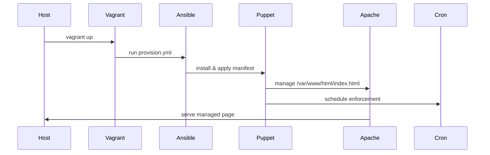

# Puppet Demo Environment

An educational environment demonstrating how **Vagrant**, **Ansible**, and **Puppet** work together to provision and maintain a simple web server.

## Overview
- **Vagrant** creates an Ubuntu VM using the `spox/ubuntu-arm` box.
- **Ansible** installs Apache and Puppet and deploys an enforcement manifest.
- **Puppet** guarantees that `/var/www/html/index.html` always contains a predefined message and schedules a cron job to reapply the manifest periodically.

## Architecture


## Repository Layout
```text
.
├── Vagrantfile         # VM definition and provisioning hooks
├── provision.yml       # Ansible playbook installing Puppet & Apache
└── manifests/
    └── site.pp         # Example Puppet site manifest
```

## Usage
1. Install [Vagrant](https://www.vagrantup.com/) and a compatible provider (VirtualBox, VMware, etc.).
2. From this directory run `vagrant up`.
3. Open `http://localhost:8080/` to view the Puppet-managed page.
4. Modify `index.html` inside the VM and watch Puppet revert the change within a minute.
5. Destroy the environment with `vagrant destroy -f` when finished.

## License
This project is licensed under the [MIT License](LICENSE).
